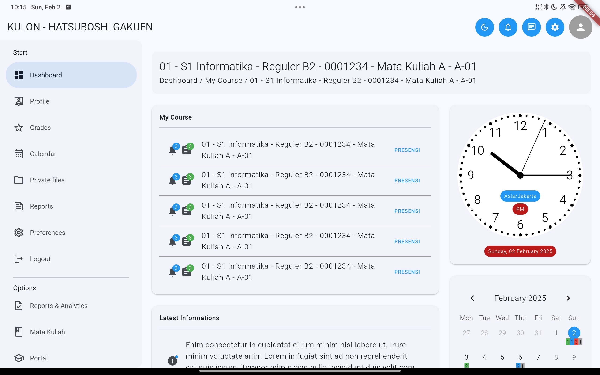

<h1 align="center">Kulon Flutter</h1>

    

  Built with <b>Flutter</b> and integrated with <b>Firebase</b>.

## Introduction
Kulon - Kuliah Online is a learning platform designed for students and lecturers. Built with Flutter, Kulon offers seamless access to educational resources across multiple devices, including Android, iOS, desktop, and web. The application provides an interactive and user-friendly environment for online lectures, assignments, discussions, and academic collaboration, ensuring a flexible and efficient learning experience anytime, anywhere.

## Contributors

  <table>
    <tr>
      <td align="center">
        <a href="https://github.com/AdmiralYuuShi">
          <b>Hapid Moch Jamil</b>
        </a>
      </td>
    </tr>
  </table>

